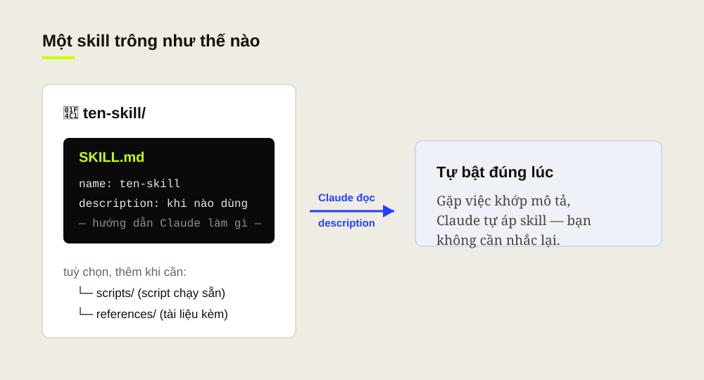

Lần đầu mở Claude lên, đa số mọi người làm đúng một việc: gõ một câu hỏi, đọc câu trả lời, rồi đóng lại. Không sai — nhưng dừng ở đó thì phí, vì mấy fen mới chạm tới cái vỏ. Claude thú vị nhất là khi mấy fen ngừng coi nó là "ô chat biết trả lời" và bắt đầu coi nó như một cộng sự có trí nhớ, có thói quen, và làm theo cách của mình.

Bài này Tui viết cho người mới hoàn toàn. Ba thứ thôi: hiểu Claude đủ để khỏi loay hoay, tạo một **project** cho ra hồn, và viết một **skill** đầu tiên. Xong ba cái đó là mấy fen đã đi trước 90% người dùng chỉ biết hỏi đáp lặt vặt.

## Đừng coi Claude là "google biết nói"

Google quăng cho mấy fen một đống link rồi để tự bơi. Claude thì làm việc _cùng_ mấy fen: đọc tài liệu mình đưa, giữ ngữ cảnh xuyên suốt, viết nháp, sửa theo góp ý, rồi lặp lại tới khi ưng. Khác biệt lớn nhất không nằm ở câu hỏi hay, mà ở chỗ mấy fen cho nó **bối cảnh** tốt tới đâu.

Cứ hình dung: thuê một người cực giỏi nhưng ngày đầu đi làm chưa biết gì về mình. Mấy fen càng nói rõ mình là ai, đang làm gì, muốn kết quả kiểu nào — người đó càng làm trúng. Project và skill chính là hai cách để "onboard" Claude một lần, xài lại mãi.

## Project — dựng cái bàn làm việc riêng cho từng đầu việc

Một **project** trong Claude là nơi gom chung ba thứ: các cuộc trò chuyện, tài liệu nền, và **chỉ dẫn riêng** (custom instructions) — tất cả trong cùng một chỗ. Thay vì mỗi lần chat lại phải kể lại từ đầu, mấy fen khai báo một lần trong project, và mọi cuộc trò chuyện bên trong đều được Claude "nhớ" bối cảnh đó.

Tạo thì nhanh, nhưng đừng bấm cho có. Ba việc nên làm ngay khi dựng project mới:

**Đặt tên & mục tiêu rõ.** Một project = một đầu việc ("Blog Cenix", "Hồ sơ khách hàng A"), đừng nhét mọi thứ vào một chỗ. Ranh giới rõ thì Claude ít lạc đề.

**Nạp tài liệu nền.** Kéo vào knowledge base những file Claude cần biết: brand guideline, ghi chú dự án, số liệu. Nạp một lần, dùng cho mọi chat trong project.

Và quan trọng nhất là phần **chỉ dẫn riêng**: viết ngắn gọn mình là ai, giọng văn muốn dùng, thứ cần tránh. Đây là chỗ tạo ra khác biệt lớn nhất mà tốn ít công nhất.

> Bối cảnh tốt đánh bại câu lệnh khôn. Mười phút khai báo project bằng cả tiếng loay hoay nhắc đi nhắc lại.

## Định hình lúc mới bắt đầu: 15 phút bây giờ, đỡ 3 tiếng sau

Sai lầm phổ biến của người mới là lao vào việc luôn, rồi ngồi sửa hoài vì kết quả cứ lệch. Bỏ ra 15 phút đầu để "định hình" sẽ tiết kiệm cho mấy fen cả buổi.

Định hình nghĩa là trả lời trước ba câu, rồi ghi thẳng vào chỉ dẫn của project: **Ai đọc/dùng kết quả này?** **Kết quả tốt trông ra sao** (độ dài, định dạng, ví dụ mẫu)? Và **có ranh giới nào tuyệt đối không được vượt?** Đưa được một ví dụ mẫu "đúng ý" vào là ăn tiền — Claude bắt chước mẫu nhanh hơn nhiều so với đọc mô tả suông.

Một mẹo nhỏ mà hiệu quả bất ngờ: bảo Claude _nhắc lại_ bằng lời của nó xem đã hiểu đúng chưa, trước khi bắt tay làm thật. Lệch chỗ nào chỉnh ngay chỗ đó, khỏi làm xong mới phát hiện đi sai từ đầu.

## Viết skill đầu tiên cho Claude

Project giúp Claude hiểu _một đầu việc_. **Skill** thì đi xa hơn: nó đóng gói _cách làm_ một loại việc để Claude tự lôi ra dùng đúng lúc, ở bất kỳ đâu — không cần mấy fen nhắc.

Cấu tạo một skill đơn giản đến bất ngờ: chỉ là một **thư mục** chứa file **SKILL.md**. File đó có phần khai báo gồm hai thứ bắt buộc — **name** (tên) và **description** (mô tả khi nào dùng) — rồi tới phần hướng dẫn Claude làm gì.

Trong đó, **description** là linh hồn. Nó quyết định _khi nào_ skill được kích hoạt, nên hãy viết như đang dặn Claude: "Dùng skill này khi... để làm..." — càng nêu rõ tình huống và mục đích càng chuẩn. **name** thì viết thường, nối bằng gạch ngang (ví dụ **viet-blog-cenix**).

  <blockquote class="editorial-split-quote-card">
Description dở thì skill nằm im. Description rõ thì Claude tự biết lúc nào cần tới.
<cite>Nguyên tắc số 1</cite></blockquote>
  

Chưa quen viết tay? Có đường tắt nè: mở một cuộc trò chuyện và **nhờ chính Claude tạo skill cho mấy fen**. Mấy fen kể mình muốn skill làm gì, hay dặn nó những gì; Claude sẽ soạn **SKILL.md** chuẩn định dạng để dùng ngay.

Và đừng cố nhồi mọi thứ vào skill đầu tiên. Bắt đầu nhỏ — một việc mấy fen lặp đi lặp lại hằng ngày — chạy thử, thấy chỗ nào Claude làm chưa trúng thì bổ sung dần. Skill tốt lớn lên theo thời gian, không đẻ ra hoàn hảo ngay.

  

## Bắt đầu từ đâu?

Nếu phải chọn một việc làm ngay hôm nay: tạo **một** project cho đầu việc mấy fen tốn thời gian nhất, viết vài dòng chỉ dẫn cho nó, rồi xài thử một tuần. Khi thấy mình cứ dặn Claude đi dặn lại cùng một kiểu — đó chính là lúc gói nó thành skill.

Còn mấy fen, việc đầu tiên muốn giao cho Claude là gì? Kể Tui nghe ở phần bình luận, biết đâu nó thành bài hướng dẫn tiếp theo.

*Nguồn tham khảo: [What are projects?](https://support.claude.com/en/articles/9517075-what-are-projects) · [What are skills?](https://support.claude.com/en/articles/12512176-what-are-skills) · [How to create custom skills](https://support.claude.com/en/articles/12512198-how-to-create-custom-skills) — Claude Help Center.*
