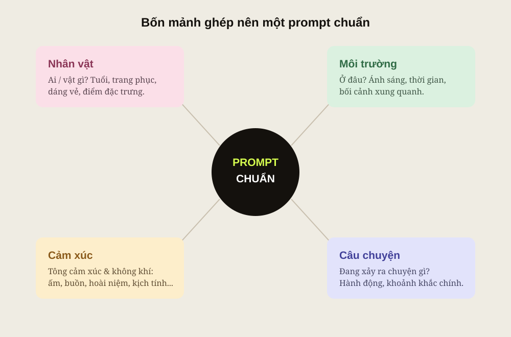

Ai mới tập tạo ảnh AI chắc cũng từng trải qua cái cảnh này: trong đầu tưởng tượng ra một khung hình đẹp lung linh, gõ vài chữ vào app, bấm tạo... rồi nhận về một tấm ảnh chẳng liên quan gì. Gõ lại, vẫn trật. Gõ chục lần, tốn cả buổi, vẫn không ra.

Vấn đề hiếm khi nằm ở cái app tạo ảnh. Nó nằm ở **prompt** — cái câu lệnh mấy fen đưa cho nó. Và đây là chỗ Claude toả sáng: thay vì tự vật lộn với câu chữ, mấy fen kể ý tưởng cho Claude bằng tiếng Việt như tâm sự với bạn, để nó "phiên dịch" thành một prompt gọn gàng, đủ ý, rồi mình bê qua bất kỳ app ảnh nào.

## Vì sao nên nhờ Claude viết, rồi mới đem đi tạo ảnh?

Các app tạo ảnh giỏi vẽ, nhưng dở đoán ý. Mấy fen viết mơ hồ thì nó đoán mò, mà đoán mò thì trật. Claude thì ngược lại: nó giỏi hiểu ý mấy fen lỏn lẻn nói ra, hỏi lại chỗ còn thiếu, rồi diễn đạt lại thành câu chữ rõ ràng, đúng thứ tự, đúng trọng tâm — kiểu ngôn ngữ mà máy vẽ "khoái".

Làm một lần, prompt đó xài được ở khắp nơi: Midjourney, DALL·E, Leonardo, Ideogram... App nào cũng ăn chung một prompt tốt. Tiện chỗ đó.

## Công thức 4 mảnh: Nhân vật – Môi trường – Cảm xúc – Câu chuyện

Một prompt "ra hồn" hầu như luôn có đủ bốn mảnh. Thiếu mảnh nào là ảnh hụt chỗ đó ngay. Cứ hình dung bốn mảnh này xoay quanh nhau, ghép lại thành một bức tranh trọn vẹn:

Cụ thể từng mảnh:

- **Nhân vật** — chủ thể chính là ai hay vật gì? Tuổi tác, trang phục, dáng vẻ, điểm đặc trưng. "Cô gái" thì mờ, "cô gái tóc ngắn, áo dài trắng, đang mỉm cười" mới rõ.
- **Môi trường** — đặt nhân vật ở đâu? Bối cảnh, thời gian, và cực kỳ quan trọng: **ánh sáng**. Nắng chiều vàng khác hẳn đèn neon ban đêm.
- **Cảm xúc** — mấy fen muốn người xem thấy gì? Ấm áp, hoài niệm, cô đơn, kịch tính... Đây là mảnh khiến ảnh có hồn thay vì đẹp mà vô cảm.
- **Câu chuyện** — trong khung hình đang xảy ra chuyện gì? Một hành động, một khoảnh khắc. "Đang ngắm phố qua ô cửa quán" kể chuyện tốt hơn là đứng đơ nhìn thẳng.

> Bốn mảnh: Nhân vật, Môi trường, Cảm xúc, Câu chuyện. Thiếu một, ảnh hụt một.

## Nói với Claude thế nào cho ra prompt chuẩn ý

Bí quyết là đừng bắt mình phải viết hay. Cứ kể lộn xộn bằng tiếng Việt bốn mảnh ở trên, rồi giao phần còn lại cho Claude. Vài câu dặn giúp prompt lên tay hẳn:

  <blockquote class="editorial-split-quote-card">
Mấy fen lo phần ý tưởng. Chuyện gọt câu chữ thành prompt, để Claude lo.
<cite>Mẹo của Tui</cite></blockquote>
  

**Bảo Claude hỏi lại nếu thiếu.** Dặn một câu: "Thiếu mảnh nào thì hỏi tui trước khi viết." Vậy là nó tự lấp lỗ hổng thay vì đoán bừa.

**Xin prompt bằng tiếng Anh.** Đa số app tạo ảnh hiểu tiếng Anh tốt hơn, nên nhờ Claude xuất bản tiếng Anh — mình vẫn trao đổi tiếng Việt thoải mái.

**Xin thêm 2–3 biến thể.** Mỗi bản nhấn một hướng khác nhau để mình thử, chọn cái gần ý nhất rồi nhờ tinh chỉnh tiếp.

**Nhớ phong cách & tỉ lệ.** Nói rõ phong cách (ảnh thật, tranh màu nước, 3D...) và tỉ lệ khung (dọc, ngang, vuông) để khỏi ra sai kích thước.

  

## Những lỗi người mới hay mắc

Đây là mấy cái bẫy khiến prompt "đánh mãi không trúng", né được là đỡ nửa đường:

- **Tả quá chung chung.** "Một bức ảnh đẹp" thì máy biết đường nào mà lần. Càng cụ thể càng trúng.
- **Nhồi 50 từ khoá rời rạc.** Quăng một đống tính từ mâu thuẫn nhau (vừa "tối giản" vừa "hoành tráng chi tiết") làm máy tẩu hoả. Ít mà đúng hơn nhiều mà loạn.
- **Quên ánh sáng & bối cảnh.** Đây là mảnh **Môi trường** bị bỏ quên nhiều nhất, mà nó quyết định phân nửa cái đẹp của ảnh.
- **Bỏ mảnh Cảm xúc.** Ảnh đủ chi tiết nhưng vô hồn thường là do quên nói mình muốn không khí gì.
- **Không nêu phong cách & tỉ lệ.** Để trống thì máy tự chọn, và thường không hợp ý.
- **Đòi trúng ngay phát đầu.** Tạo ảnh là chuyện thử và chỉnh. Ra chưa ưng thì kể lại cho Claude "chỗ này chưa đúng", nó gọt tiếp — chứ đừng bỏ cuộc sau một lần.

## Chốt lại

Đừng ngồi vắt óc viết prompt cho hay. Việc của mấy fen là hình dung cho rõ bốn mảnh — Nhân vật, Môi trường, Cảm xúc, Câu chuyện — rồi kể cho Claude nghe. Phần gọt giũa thành prompt chuẩn, cứ để Tui... à nhầm, để Claude lo.

Mấy fen định vẽ cái gì đầu tiên? Thả ý tưởng ở phần bình luận, Tui viết thử prompt cho coi.

*Tham khảo thêm về cách ra chỉ dẫn cho Claude: [Prompt engineering overview](https://docs.claude.com/en/docs/build-with-claude/prompt-engineering/overview) — Anthropic.*
